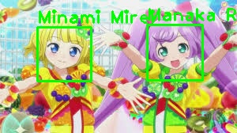

# PRIPARA character face recognition using of informramiz/opencv-face-recognition-python

## Abstract

1. Train face_recognizer from sets of anime capture images, using of [nagadomi/lbpcascade_animeface](https://github.com/nagadomi/lbpcascade_animeface)

2. Do character recognition. Modified [nagadomi/lbpcascade_animeface](https://github.com/nagadomi/lbpcascade_animeface) to draw all face detection(recognition) results on a source image.

> In original code, Draw one face per one input image even though there are multiple detection(recognition) results.

## Upcoming experiments

- **Recognize ドロシー・ウェスト**
- **Recognize ドロシー・ウェスト**
- **Recognize ドロシー・ウェスト**
- **Recognize ドロシー・ウェスト**
- **Recognize ドロシー・ウェスト**